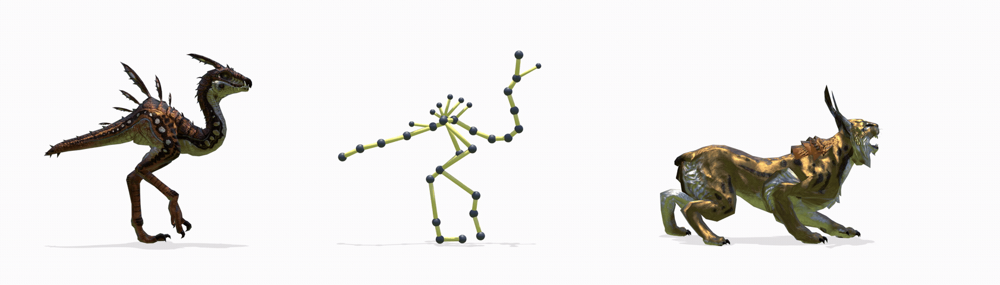

<div align="center">

# Neural Motion Blending Across Arbitrary Character Topologies

[](https://arxiv.org/abs/2607.10370)
[](https://mmlab-cv.github.io/neural_motion_blending/)

**[Luca Cazzola](https://scholar.google.com/citations?user=fsnsqoYAAAAJ)<sup>1</sup> ·
[Giulia Martinelli](https://giuli13.github.io/)<sup>1,2</sup> ·
[Nicola Conci](https://scholar.google.com/citations?user=mR1GK28AAAAJ)<sup>1,2</sup>**
<br><sub><sup>1</sup> University of Trento · <sup>2</sup> CNIT · [MMLab](https://github.com/mmlab-cv)</sub>



</div>

<br>

## 🚀 Quick start

> ⚠️ **Just want to try the tool out ???** Check out  [**BlendAnything**](https://mmlab-cv.github.io/BlendAnything/), the <u>Blender plugin</u> that brings this work straight into <u>Blender's NLA editor.</u> ⚠️

### 1 · 🛠️ Setup

Get the code
```bash
git clone https://github.com/mmlab-cv/neural_motion_blending.git
cd neural_motion_blending
```

Dependancies and environment
```bash
conda env create --file environment.yaml
conda activate neural_motion_blending
pip install --no-build-isolation git+https://github.com/inbar-2344/Motion.git
```
(The classical NLA baseline and Blender visualizer additionally need a [Blender](https://www.blender.org/)
install with `Motion` importable from Blender's own Python.)

### 2 · 📦 Get the data & models

Truebones Zoo is a closed-source, paid asset — see [docs/DATA.md](docs/DATA.md) to purchase and
process it.

Download the pretrained blending checkpoints,
[`blendany_model_weights.zip`](https://drive.google.com/drive/folders/1LX4r0hspvJP8jax6wYB67mLf5yKuUY4Z?usp=drive_link),
and extract its model folders into `save/`. The model reported in the paper is
`truebones_globpool` (`save/truebones_globpool/{args.json,model*.pt}`) — the "attention-pool"
variant (`truebones_attnpool`) is also included as an alternative (see
[docs/TRAIN.md](docs/TRAIN.md)).

### 3 · 📖 Usage

| Guide | Covers |
|---|---|
| [docs/DATA.md](docs/DATA.md) | 🦴 Preparing Truebones and custom skeletons |
| [docs/TRAIN.md](docs/TRAIN.md) | 🏋️ Training AnyTop / MoDiffAE |
| [docs/SAMPLE.md](docs/SAMPLE.md) | 🎬 Generating, blending & retargeting motion (`sample/mix.py`), the NLA baseline |
| [eval/README.md](eval/README.md) | 📊 Blending & latent-FID benchmarks |
| [docs/VISUALIZATION.md](docs/VISUALIZATION.md) | 🎥 Stick-figure renders |

<br>

## 💜 Cite Us 💜

If you use this work, please cite the CGI 2026 paper. In the mean time... the ArXiv prepring.

```bash
@misc{cazzola2026neuralmotionblendingarbitrary,
      title={Neural Motion Blending Across Arbitrary Character Topologies}, 
      author={Luca Cazzola and Giulia Martinelli and Nicola Conci},
      year={2026},
      eprint={2607.10370},
      archivePrefix={arXiv},
      primaryClass={cs.CV},
      url={https://arxiv.org/abs/2607.10370}, 
}
```
